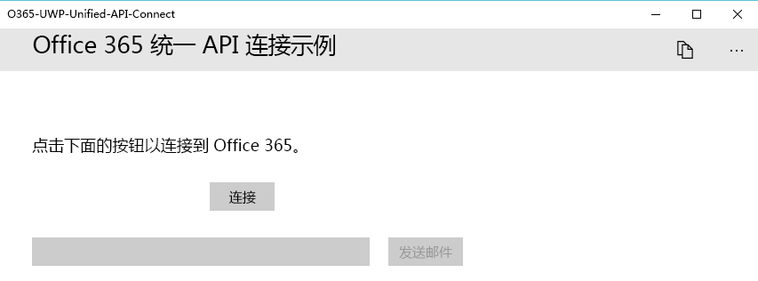
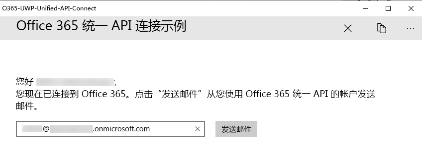

# <a name="get-started-with-microsoft-graph-in-a-universal-windows-10-app"></a>在通用 Windows 10 应用中开始使用 Microsoft Graph

> **为企业客户生成应用？**如果企业客户启用企业移动性安全功能，如<a href="https://azure.microsoft.com/en-us/documentation/articles/active-directory-conditional-access-device-policies/" target="_newtab">条件性设备访问</a>，应用可能无法运行。在这种情况下，你可能不知道，而且客户可能会遇到错误。 

> 若要在**所有企业方案**中支持**所有企业客户**，必须使用 Azure AD 终结点并使用 [Azure 管理门户](https://aka.ms/aadapplist)管理应用。有关详细信息，请参阅 [在 Azure AD 和 Azure AD v2.0 终结点之间进行选择](../authorization/auth_overview.md#deciding-between-the-azure-ad-and-azure-ad-v20-endpoints)。

本文介绍了从 [Azure AD v2.0 终结点](https://developer.microsoft.com/en-us/graph/docs/authorization/converged_auth) 获取访问令牌和调用 Microsoft Graph 所需的任务。本文演示了 [适用于 UWP 的 Microsoft Graph Connect 示例 (REST)](https://github.com/microsoftgraph/uwp-csharp-connect-rest-sample) 和 [适用于 UWP 的 Microsoft Graph Connect 示例（库）](https://github.com/microsoftgraph/uwp-csharp-connect-sample) 示例中的代码，以说明在使用 Microsoft Graph 的应用中必须实现的主要概念。本文还介绍如何通过使用原始 REST 调用和 [Microsoft Graph 客户端库](http://www.nuget.org/packages/Microsoft.Graph/) 来访问 Microsoft Graph。

可以从以下 GitHub 存储库中下载将要在本演练中创建的两个应用版本：

* [适用于 UWP 的 Microsoft Graph Connect 示例 (REST)](https://github.com/microsoftgraph/uwp-csharp-connect-rest-sample)
* [适用于 UWP 的 Microsoft Graph Connect 示例（库）](https://github.com/microsoftgraph/uwp-csharp-connect-sample)

**不想生成一个应用吗？**使用 [Microsoft Graph 快速入门](https://graph.microsoft.io/en-us/getting-started) 快速准备就绪并开始运行。

## <a name="sample-user-interface"></a>示例用户界面

该示例包含一个非常简单的用户界面，其中包括一个顶部命令栏、一个**连接按钮**、一个**发送邮件**按钮，以及一个会自动填充登录用户电子邮件地址的文本框，但是该文本框可以进行编辑。

当用户未连接时，**发送邮件**按钮处于禁用状态：



当用户已连接时，顶部命令栏包含一个断开连接按钮。



所有示例的 UI 字符串均存储在 Assets 文件夹中的 Resources.resw 文件中。

## <a name="prerequisites"></a>先决条件

若要开始，将需要以下各项： 

- 一个 [Microsoft 帐户](https://www.outlook.com/) 或者一个[工作或学校帐户](http://dev.office.com/devprogram)
- Visual Studio 2015 
- [适用于 UWP 的 Microsoft Graph 初学者项目（库）](https://github.com/microsoftgraph/uwp-csharp-connect-sample/tree/master/starter) 或 [适用于 UWP 的 Microsoft Graph 初学者项目 (REST)](https://github.com/microsoftgraph/uwp-csharp-connect-rest-sample/tree/master/starter)。两个模板均包含可向其中添加代码的空类。它们还包含资源字符串。要获取两个项目中的一个或全部，请克隆或下载 [适用于 UWP 的 Microsoft Graph Connect 示例（库）](https://github.com/microsoftgraph/uwp-csharp-connect-sample) 和/或 [适用于 UWP 的 Microsoft Graph Connect 示例 (REST)](https://github.com/microsoftgraph/uwp-csharp-connect-rest-sample)，然后打开“**初学者**”文件夹中的解决方案。


## <a name="register-the-app"></a>注册应用
 
1. 使用个人或工作或学校帐户登录到 [应用注册门户](https://apps.dev.microsoft.com/)。
2. 选择“**添加应用**”。
3. 为应用输入名称，并选择“**创建应用程序**”。
    
    将显示注册页，其中列出应用的属性。
 
4. 在“**平台**”下，选择“**添加平台**”。
5. 选择“**移动平台**”。
6. 将客户端 ID（应用程序 ID）和重定向 URL 值复制到剪切板。将需要在示例应用中输入这些值。

    应用 ID 是应用的唯一标识符。重定向 URL 是由 Windows 10 为每个应用提供的唯一 URI，以确保发送到该 URI 的邮件只发送到该应用程序。 

7. 选择“**保存**”。

## <a name="configure-the-project"></a>配置项目

1. 在 Visual Studio 中打开初学者项目的解决方案文件。
2. 打开项目的 **App.xaml** 文件，并找到 `Application.Resources` 节点。使用注册应用的相应值替换应用程序 ID 和重定向 URI 占位符。


```xml
    <Application.Resources>
        <!-- Add your Client Id here. -->
        <x:String x:Key="ida:ClientID">ENTER_YOUR_CLIENT_ID</x:String>
        <!-- Add your Redirect URI here. -->
        <x:String x:Key="ida:ReturnUrl">ENTER_YOUR_REDIRECT_URI</x:String>
    </Application.Resources>
```

## <a name="install-the-microsoft-authentication-library-msal"></a>安装 Microsoft 身份验证库 (MSAL)

[Microsoft 身份验证库](https://www.nuget.org/packages/Microsoft.Identity.Client) 包含更容易通过 Azure AD v2.0 终结点对用户进行身份验证的类和方法。

1. 在解决方案资源管理器中，右键单击项目名称，并选择“**管理 NuGet 包...**”
2. 单击“浏览”，然后搜索 Microsoft.Identity.Client。
3. 选择最新版本的 Microsoft 身份验证库，然后单击“**安装**”。

## <a name="install-the-microsoft-graph-client-library"></a>安装 Microsoft Graph 客户端库

> **注意** 如果打算使用原始的 REST 调用来访问 Microsoft Graph，则可以跳过本部分。

1. 在解决方案资源管理器中，右键单击项目名称，并选择“**管理 NuGet 包...**”
2. 单击“浏览”，然后搜索 Microsoft.Graph。
3. 选择最新版本的 Microsoft Graph 客户端库，然后单击“**安装**”。

## <a name="create-the-authenticationhelpercs-class"></a>创建 AuthenticationHelper.cs 类

打开初学者项目中的 AuthenticationHelper.cs 文件。该文件中包含所有身份验证代码，以及存储用户信息并仅在用户与应用断开连接时强制进行身份验证的其他逻辑。该类包含至少两种方法：`GetTokenForUserAsync` 和 `Signout`。如果使用的是 Microsoft Graph 客户端库，则需要添加第三种方法：`GetAuthenticatedClient`。

当用户进行身份验证并且之后应用每次调用 Microsoft Graph 时，都会运行 ``GetTokenHelperAsync`` 方法。

**使用声明**

***客户端库版本***

如果使用的是 Microsoft Graph 客户端库，则需要以下声明：

```c#
using System;
using System.Diagnostics;
using System.Net.Http.Headers;
using System.Threading.Tasks;
using Microsoft.Graph;
using Microsoft.Identity.Client;
```

***REST 版本***

如果使用原始 REST 调用访问 Microsoft Graph，则需要 AuthenticationHelper 类中的以下 `using` 声明：

```c#
using System;
using System.Threading.Tasks;
using Windows.Storage;
using Microsoft.Identity.Client;
```

**类字段**

AuthenticationHelper 类的两个版本都需要以下字段：

```c#
// The Client ID is used by the application to uniquely identify itself to the Azure AD v2.0 endpoint.
static string clientId = App.Current.Resources["ida:ClientID"].ToString();
public static string[] Scopes = { "User.Read", "Mail.Send" };
public static PublicClientApplication IdentityClientApp = new PublicClientApplication(clientId);
public static string TokenForUser = null;
public static DateTimeOffset Expiration;
```

请注意，这两个版本均使用 MSAL `PublicClientApplication` 类来对用户进行身份验证。当用户进行身份验证时，`Scopes` 字段将存储应用需要请求的 Microsoft Graph 权限范围。 

***客户端库版本***

如果使用的是客户端库，请将 `GraphServicesClient` 存储为一个字段，以便只需进行一次构建：

```c#
private static GraphServiceClient graphClient = null;
```

***REST 版本***

如果使用的是 REST 调用，则需要存储应用的漫游设置中的部分值，因为需要存储有关用户的信息。（客户端库在其他版本中提供该信息。）

```c#
public static ApplicationDataContainer _settings = ApplicationData.Current.RoamingSettings;
```

**GetTokenForUserAsync**

***客户端库版本***

`GetTokenForUserAsync` 方法使用 PublicClientApplicationClass 和 ClientId 设置为用户获取访问令牌。如果用户尚未进行身份验证，它将启动身份验证 UI。如果使用的是客户端库，那么这就是要使用的方法的版本。

```c#
        public static async Task<string> GetTokenForUserAsync()
        {
            AuthenticationResult authResult;
            try
            {
                authResult = await IdentityClientApp.AcquireTokenSilentAsync(Scopes);
                TokenForUser = authResult.Token;
            }

            catch (Exception)
            {
                if (TokenForUser == null || Expiration <= DateTimeOffset.UtcNow.AddMinutes(5))
                {
                    authResult = await IdentityClientApp.AcquireTokenAsync(Scopes);

                    TokenForUser = authResult.Token;
                    Expiration = authResult.ExpiresOn;
                }
            }

            return TokenForUser;
        }
```

***REST 版本***

`GetTokenForUserAsync` 方法的 REST 版本能实现的操作更多，因为它还需要存储有关登录用户的一些信息。

```c#
        public static async Task<string> GetTokenForUserAsync()
        {
            AuthenticationResult authResult;
            try
            {
                authResult = await IdentityClientApp.AcquireTokenSilentAsync(Scopes);
                TokenForUser = authResult.Token;
                // save user ID in local storage
                _settings.Values["userID"] = authResult.User.UniqueId;
                _settings.Values["userEmail"] = authResult.User.DisplayableId;
                _settings.Values["userName"] = authResult.User.Name;
            }

            catch (Exception)
            {
                if (TokenForUser == null || Expiration <= DateTimeOffset.UtcNow.AddMinutes(5))
                {
                    authResult = await IdentityClientApp.AcquireTokenAsync(Scopes);

                    TokenForUser = authResult.Token;
                    Expiration = authResult.ExpiresOn;

                    // save user ID in local storage
                    _settings.Values["userID"] = authResult.User.UniqueId;
                    _settings.Values["userEmail"] = authResult.User.DisplayableId;
                    _settings.Values["userName"] = authResult.User.Name;
                }
            }

            return TokenForUser;
        }
```

**注销**

两个版本中的 `Signout` 方法注销通过 `PublicClientApplication` 登录的所有用户（在本例中只有一个用户），并置空 `TokenForUser` 值。使用客户端库的版本还会置空存储的 `GraphServicesClient`，REST 版本会置空应用的漫游设置中存储的值。

***客户端库版本***

这是 `Signout` 方法的客户端库版本。

```c#
        public static void SignOut()
        {
            foreach (var user in IdentityClientApp.Users)
            {
                user.SignOut();
            }
            graphClient = null;
            TokenForUser = null;

        }
``` 

***REST 版本***

这是 `Signout` 方法的 REST 版本。

```c#
        public static void SignOut()
        {
            foreach (var user in IdentityClientApp.Users)
            {
                user.SignOut();
            }

            TokenForUser = null;

            //Clear stored values from last authentication.
            _settings.Values["userID"] = null;
            _settings.Values["userEmail"] = null;
            _settings.Values["userName"] = null;

        }
```

**GetAuthenticatedClient（仅客户端库）**

最后，如果使用的是客户端库，则需要一个创建 `GraphServicesClient` 的方法。此方法创建一个客户端，以对每个从客户端到 Microsoft Graph 的调用使用 `GetTokenForUserAsync` 方法。

```c#
        public static GraphServiceClient GetAuthenticatedClient()
        {
            if (graphClient == null)
            {
                // Create Microsoft Graph client.
                try
                {
                    graphClient = new GraphServiceClient(
                        "https://graph.microsoft.com/v1.0",
                        new DelegateAuthenticationProvider(
                            async (requestMessage) =>
                            {
                                var token = await GetTokenForUserAsync();
                                requestMessage.Headers.Authorization = new AuthenticationHeaderValue("bearer", token);
                            }));
                    return graphClient;
                }

                catch (Exception ex)
                {
                    Debug.WriteLine("Could not create a graph client: " + ex.Message);
                }
            }

            return graphClient;
        }
```

## <a name="send-an-email-with-microsoft-graph"></a>使用 Microsoft Graph 发送电子邮件

打开初学者项目中的 MailHelper.cs 文件。该文件中包含构建并发送电子邮件的代码。它包含一个方法 -- ``ComposeAndSendMailAsync`` -- 该方法构建 POST 请求并将其发送到 **https://graph.microsoft.com/v1.0/me/microsoft.graph.SendMail** 终结点。 

``ComposeAndSendMailAsync`` 方法采用三个字符串值 -- ``subject``、``bodyContent`` 和 ``recipients`` -- 通过 MainPage.xaml.cs 文件将这些值传递给它。``subject`` 和 ``bodyContent`` 字符串随所有其他 UI 字符串存储在 Resources.resw 文件中。``recipients`` 字符串来自应用界面中的地址框中。 

**REST 版本**

此文件的 REST 版本需要以下 `using` 声明：

```c#
using System;
using System.Threading.Tasks;
```

由于用户可以传递多个地址，因此第一项任务是将 ``recipients`` 字符串拆分为一组 EmailAddress 对象，然后能够以请求 POST 正文的形式传递这些对象：

```c#
            // Prepare the recipient list
            string[] splitter = { ";" };
            var splitRecipientsString = recipients.Split(splitter, StringSplitOptions.RemoveEmptyEntries);
            string recipientsJSON = null;

            int n = 0;
            foreach (string recipient in splitRecipientsString)
            {
                if ( n==0)
                recipientsJSON += "{'EmailAddress':{'Address':'" + recipient.Trim() + "'}}";
                else
                {
                    recipientsJSON += ", {'EmailAddress':{'Address':'" + recipient.Trim() + "'}}";
                }
                n++;
            }
```

另一项任务是构建有效的 JSON 邮件对象，然后通过 HTTP POST 请求将它发送至 **me/microsoft.graph.SendMail** 终结点。由于 ``bodyContent`` 字符串是一个 HTML 文档，因此请求将 **ContentType** 值设置为 HTML。另请注意对 ``AuthenticationHelper.GetTokenHelperAsync`` 的调用，以确保我们在请求中传递全新的访问令牌。

```c#
                HttpClient client = new HttpClient();
                var token = await AuthenticationHelper.GetTokenHelperAsync();
                client.DefaultRequestHeaders.Add("Authorization", "Bearer " + token);

                // Build contents of post body and convert to StringContent object.
                // Using line breaks for readability.
                string postBody = "{'Message':{" 
                    +  "'Body':{ " 
                    + "'Content': '" + bodyContent + "'," 
                    + "'ContentType':'HTML'}," 
                    + "'Subject':'" + subject + "'," 
                    + "'ToRecipients':[" + recipientsJSON +  "]}," 
                    + "'SaveToSentItems':true}";

                var emailBody = new StringContent(postBody, System.Text.Encoding.UTF8, "application/json");

                HttpResponseMessage response = await client.PostAsync(new Uri("https://graph.microsoft.com/v1.0/me/microsoft.graph.SendMail"), emailBody);

                if ( !response.IsSuccessStatusCode)
                {

                    throw new Exception("We could not send the message: " + response.StatusCode.ToString());
                }
```

完整的类如下所示：

```c#
    class MailHelper
    {
        /// <summary>
        /// Compose and send a new email.
        /// </summary>
        /// <param name="subject">The subject line of the email.</param>
        /// <param name="bodyContent">The body of the email.</param>
        /// <param name="recipients">A semicolon-separated list of email addresses.</param>
        /// <returns></returns>
        internal async Task ComposeAndSendMailAsync(string subject,
                                                            string bodyContent,
                                                            string recipients)
        {

            // Prepare the recipient list
            string[] splitter = { ";" };
            var splitRecipientsString = recipients.Split(splitter, StringSplitOptions.RemoveEmptyEntries);
            string recipientsJSON = null;

            int n = 0;
            foreach (string recipient in splitRecipientsString)
            {
                if ( n==0)
                recipientsJSON += "{'EmailAddress':{'Address':'" + recipient.Trim() + "'}}";
                else
                {
                    recipientsJSON += ", {'EmailAddress':{'Address':'" + recipient.Trim() + "'}}";
                }
                n++;
            }

            try
            {

                HttpClient client = new HttpClient();
                var token = await AuthenticationHelper.GetTokenForUserAsync();
                client.DefaultRequestHeaders.Add("Authorization", "Bearer " + token);

                // Build contents of post body and convert to StringContent object.
                // Using line breaks for readability.
                string postBody = "{'Message':{" 
                    +  "'Body':{ " 
                    + "'Content': '" + bodyContent + "'," 
                    + "'ContentType':'HTML'}," 
                    + "'Subject':'" + subject + "'," 
                    + "'ToRecipients':[" + recipientsJSON +  "]}," 
                    + "'SaveToSentItems':true}";

                var emailBody = new StringContent(postBody, System.Text.Encoding.UTF8, "application/json");

                HttpResponseMessage response = await client.PostAsync(new Uri("https://graph.microsoft.com/v1.0/me/microsoft.graph.SendMail"), emailBody);

                if ( !response.IsSuccessStatusCode)
                {

                    throw new Exception("We could not send the message: " + response.StatusCode.ToString());
                }


            }

            catch (Exception e)
            {
                throw new Exception("We could not send the message: " + e.Message);
            }
        }
    }
```

**客户端库版本**

此文件的客户端库版本需要以下 `using` 声明：

```c#
using System;
using System.Collections.Generic;
using System.Threading.Tasks;
```

通过客户端库发送邮件的代码与使用 REST 调用的代码非常相似。创建客户端库中定义的等效对象，并将生成的 `Message` 对象传递到 `GraphServiceClient` 的 `SendMail` 方法，而不是创建 JSON 对象并将其直接传递到 HTTP POST 请求中的 **SendMail** 终结点。客户端提取访问令牌并将请求传递到 **SendMail** 终结点。

完整的类如下所示：

```c#
    public class MailHelper
    {
        /// <summary>
        /// Compose and send a new email.
        /// </summary>
        /// <param name="subject">The subject line of the email.</param>
        /// <param name="bodyContent">The body of the email.</param>
        /// <param name="recipients">A semicolon-separated list of email addresses.</param>
        /// <returns></returns>
        public async Task ComposeAndSendMailAsync(string subject,
                                                            string bodyContent,
                                                            string recipients)
        {

            // Prepare the recipient list
            string[] splitter = { ";" };
            var splitRecipientsString = recipients.Split(splitter, StringSplitOptions.RemoveEmptyEntries);
            List<Recipient> recipientList = new List<Recipient>();

            foreach (string recipient in splitRecipientsString)
            {
                recipientList.Add(new Recipient { EmailAddress = new EmailAddress { Address = recipient.Trim() } });
            }

            try
            {
                var graphClient = AuthenticationHelper.GetAuthenticatedClient();

                var email = new Message
                {
                    Body = new ItemBody
                    {
                        Content = bodyContent,
                        ContentType = BodyType.Html,
                    },
                    Subject = subject,
                    ToRecipients = recipientList,
                };

                try
                {
                    await graphClient.Me.SendMail(email, true).Request().PostAsync();
                }
                catch (ServiceException exception)
                {
                    throw new Exception("We could not send the message: " + exception.Error == null ? "No error message returned." : exception.Error.Message);
                }


            }

            catch (Exception e)
            {
                throw new Exception("We could not send the message: " + e.Message);
            }
        }
    }
``` 

##<a name="create-the-user-interface-in-mainpagexaml"></a>在 MainPage.xaml 中创建用户界面

现在，已经编写了通过 Microsoft Graph 执行用户身份验证并发送邮件的代码，只需创建上述的简单界面。 

初学者项目中的 MainPage.xaml 文件已经包含了所有需要的 XAML。只需将驱动界面的代码添加到 MainPage.xaml.cs 文件。在项目中找到该文件并打开。

此文件已包含该示例的客户端库版本和 REST 版本需要的所有 `using` 声明。

***客户端库版本***

对用户进行身份验证份时，应用的客户端库版本会创建 `GraphServiceClient`。 

添加命名空间中的此代码来完成 MainPage.xaml.cs 中 MainPage 类的客户端库版本：

```c#
    public sealed partial class MainPage : Page
    {
        private string _mailAddress;
        private string _displayName = null;
        private MailHelper _mailHelper = new MailHelper();

        public MainPage()
        {
            this.InitializeComponent();
        }

        protected override void OnNavigatedTo(NavigationEventArgs e)
        {
            // Developer code - if you haven't registered the app yet, we warn you. 
            if (!App.Current.Resources.ContainsKey("ida:ClientID"))
            {
                InfoText.Text = ResourceLoader.GetForCurrentView().GetString("NoClientIdMessage");
                ConnectButton.IsEnabled = false;
            }
            else
            {
                InfoText.Text = ResourceLoader.GetForCurrentView().GetString("ConnectPrompt");
                ConnectButton.IsEnabled = true;
            }
        }

        /// <summary>
        /// Signs in the current user.
        /// </summary>
        /// <returns></returns>
        public async Task<bool> SignInCurrentUserAsync()
        {
            var graphClient = AuthenticationHelper.GetAuthenticatedClient();

            if (graphClient != null)
            {
                var user = await graphClient.Me.Request().GetAsync();
                string userId = user.Id;
                _mailAddress = user.UserPrincipalName;
                _displayName = user.DisplayName;
                return true;
            }
            else
            {
                return false;
            }

        }


        private async void ConnectButton_Click(object sender, RoutedEventArgs e)
        {
            ProgressBar.Visibility = Visibility.Visible;
            if (await SignInCurrentUserAsync())
            { 
                InfoText.Text = "Hi " + _displayName + "," + Environment.NewLine + ResourceLoader.GetForCurrentView().GetString("SendMailPrompt");
                MailButton.IsEnabled = true;
                EmailAddressBox.IsEnabled = true;
                ConnectButton.Visibility = Visibility.Collapsed;
                DisconnectButton.Visibility = Visibility.Visible;
                EmailAddressBox.Text = _mailAddress;
            }
            else
            {
                InfoText.Text = ResourceLoader.GetForCurrentView().GetString("AuthenticationErrorMessage");
            }

            ProgressBar.Visibility = Visibility.Collapsed;
        }

        private async void MailButton_Click(object sender, RoutedEventArgs e)
        {
            _mailAddress = EmailAddressBox.Text;
            ProgressBar.Visibility = Visibility.Visible;
            MailStatus.Text = string.Empty;
            try
            {
                await _mailHelper.ComposeAndSendMailAsync(ResourceLoader.GetForCurrentView().GetString("MailSubject"), ComposePersonalizedMail(_displayName), _mailAddress);
                MailStatus.Text = string.Format(ResourceLoader.GetForCurrentView().GetString("SendMailSuccess"), _mailAddress);
            }
            catch (Exception)
            {
                MailStatus.Text = ResourceLoader.GetForCurrentView().GetString("MailErrorMessage");
            }
            finally
            {
                ProgressBar.Visibility = Visibility.Collapsed;
            }
            
        }

        // <summary>
        // Personalizes the email.
        // </summary>
        public static string ComposePersonalizedMail(string userName)
        {
            return String.Format(ResourceLoader.GetForCurrentView().GetString("MailContents"), userName);
        }

        private void Disconnect_Click(object sender, RoutedEventArgs e)
        {
            ProgressBar.Visibility = Visibility.Visible;
            AuthenticationHelper.SignOut();
            ProgressBar.Visibility = Visibility.Collapsed;
            MailButton.IsEnabled = false;
            EmailAddressBox.IsEnabled = false;
            ConnectButton.Visibility = Visibility.Visible;
            InfoText.Text = ResourceLoader.GetForCurrentView().GetString("ConnectPrompt");
            this._displayName = null;
            this._mailAddress = null;
        }
    }
```

***REST 版本***

此类的 REST 版本与客户端库版本看起来非常类似，不同之处在于，当对用户进行身份验证时，它直接调用 `GetTokenForUserAsync` 方法。它还从应用的漫游设置中检索用户值。 

添加命名空间中的此代码来完成 MainPage.xaml.cs 中 MainPage 类的 REST 版本：

```c#
    public sealed partial class MainPage : Page
    {
        private string _mailAddress;
        private string _displayName = null;
        private MailHelper _mailHelper = new MailHelper();
        public static ApplicationDataContainer _settings = ApplicationData.Current.RoamingSettings;

        public MainPage()
        {
            this.InitializeComponent();
        }

        protected override void OnNavigatedTo(NavigationEventArgs e)
        {
            // Developer code - if you haven't registered the app yet, we warn you. 
            if (!App.Current.Resources.ContainsKey("ida:ClientID"))
            {
                InfoText.Text = ResourceLoader.GetForCurrentView().GetString("NoClientIdMessage");
                ConnectButton.IsEnabled = false;
            }
            else
            {
                InfoText.Text = ResourceLoader.GetForCurrentView().GetString("ConnectPrompt");
                ConnectButton.IsEnabled = true;
            }
        }

        /// <summary>
        /// Signs in the current user.
        /// </summary>
        /// <returns></returns>
        public async Task<bool> SignInCurrentUserAsync()
        {
            var token = await AuthenticationHelper.GetTokenForUserAsync();

            if (token != null)
            {
                string userId = (string)_settings.Values["userID"];
                _mailAddress = (string)_settings.Values["userEmail"];
                _displayName = (string)_settings.Values["userName"];
                return true;
            }
            else
            {
                return false;
            }

        }


        private async void ConnectButton_Click(object sender, RoutedEventArgs e)
        {
            ProgressBar.Visibility = Visibility.Visible;
            if (await SignInCurrentUserAsync())
            { 
                InfoText.Text = "Hi " + _displayName + "," + Environment.NewLine + ResourceLoader.GetForCurrentView().GetString("SendMailPrompt");
                MailButton.IsEnabled = true;
                EmailAddressBox.IsEnabled = true;
                ConnectButton.Visibility = Visibility.Collapsed;
                DisconnectButton.Visibility = Visibility.Visible;
                EmailAddressBox.Text = _mailAddress;
            }
            else
            {
                InfoText.Text = ResourceLoader.GetForCurrentView().GetString("AuthenticationErrorMessage");
            }

            ProgressBar.Visibility = Visibility.Collapsed;
        }

        private async void MailButton_Click(object sender, RoutedEventArgs e)
        {
            _mailAddress = EmailAddressBox.Text;
            ProgressBar.Visibility = Visibility.Visible;
            MailStatus.Text = string.Empty;
            try
            {
                await _mailHelper.ComposeAndSendMailAsync(ResourceLoader.GetForCurrentView().GetString("MailSubject"), ComposePersonalizedMail(_displayName), _mailAddress);
                MailStatus.Text = string.Format(ResourceLoader.GetForCurrentView().GetString("SendMailSuccess"), _mailAddress);
            }
            catch (Exception)
            {
                MailStatus.Text = ResourceLoader.GetForCurrentView().GetString("MailErrorMessage");
            }
            finally
            {
                ProgressBar.Visibility = Visibility.Collapsed;
            }
            
        }

        // <summary>
        // Personalizes the email.
        // </summary>
        public static string ComposePersonalizedMail(string userName)
        {
            return String.Format(ResourceLoader.GetForCurrentView().GetString("MailContents"), userName);
        }

        private void Disconnect_Click(object sender, RoutedEventArgs e)
        {
            ProgressBar.Visibility = Visibility.Visible;
            AuthenticationHelper.SignOut();
            ProgressBar.Visibility = Visibility.Collapsed;
            MailButton.IsEnabled = false;
            EmailAddressBox.IsEnabled = false;
            ConnectButton.Visibility = Visibility.Visible;
            InfoText.Text = ResourceLoader.GetForCurrentView().GetString("ConnectPrompt");
            this._displayName = null;
            this._mailAddress = null;
        }
    }
```
 
现在，已经执行了与 Microsoft Graph 进行交互所需的三个步骤：应用注册、用户身份验证以及进行请求。 

## <a name="run-the-app"></a>运行应用
1. 按 F5 生成和运行此应用。 

2. 使用你的个人、工作或学校帐户登录，并授予所请求的权限。

3. 选择**发送电子邮件**按钮。在邮件发送后，按钮下方将显示成功消息。

## <a name="next-steps"></a>后续步骤
- 使用 [Graph 浏览器](https://graph.microsoft.io/graph-explorer) 试用 REST API。
- 在 [Microsoft Graph UWP 代码段示例 (SDK)](https://github.com/microsoftgraph/uwp-csharp-snippets-sample) 和 [Microsoft Graph UWP 代码段示例 (REST)](https://github.com/microsoftgraph/uwp-csharp-snippets-rest-sample) 中查找 REST 和 SDK 操作的常见操作示例，或在 GitHub 上浏览我们的其他 [UWP 示例](https://github.com/microsoftgraph?utf8=%E2%9C%93&query=uwp)。

## <a name="see-also"></a>另请参阅
- [Microsoft Graph.NET 客户端库](https://github.com/microsoftgraph/msgraph-sdk-dotnet)
- [Azure AD v2.0 协议](https://azure.microsoft.com/en-us/documentation/articles/active-directory-v2-protocols/)
- [Azure AD v2.0 令牌](https://azure.microsoft.com/en-us/documentation/articles/active-directory-v2-tokens/)

